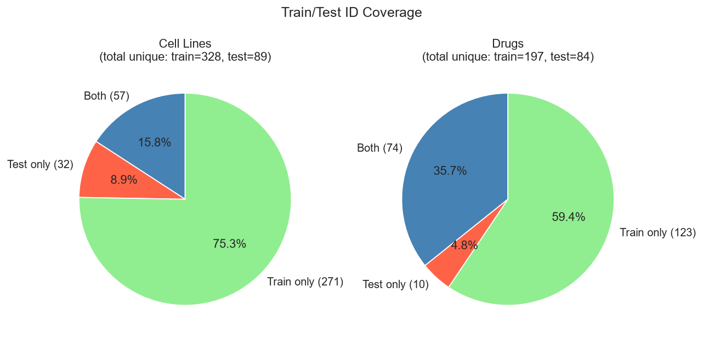
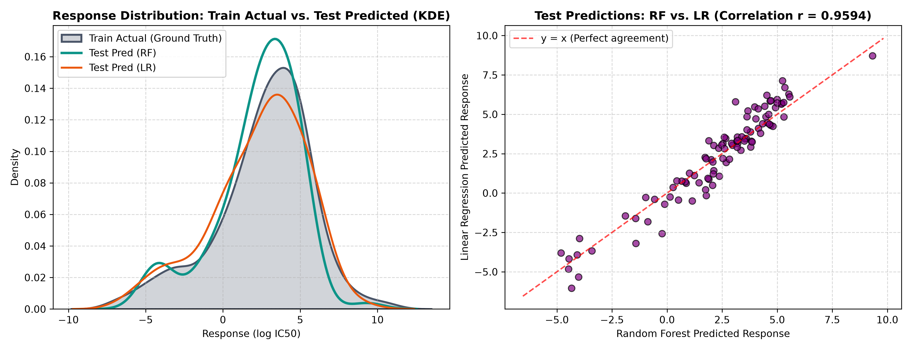
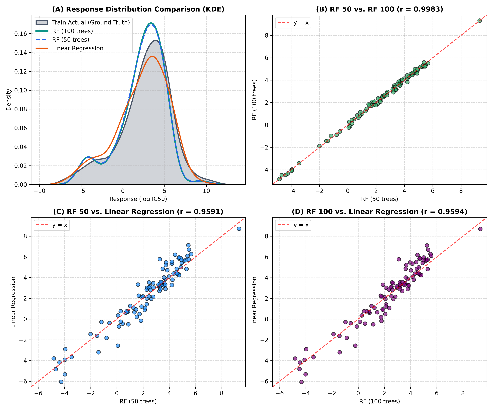

# Data Study Report (9/5, 9/6)

## AI Assistance
Used Antigravity (Claude Sonnet 4.6, Gemini 3.8 Flash) to help write and debug Python scripts for data inspection and solution.py. All code was reviewed and understood by the author.

## Process
- Study readme
- Loading data
- First glance of data
- Discuss and write code with Antigravity(Claude)
- Check results
- Discuss and analyse the results with antigravity

## Brief Data Understanding (before processing and discussion)

- 大致看起來像是細胞型態跟藥物各種組合的實驗數據，但我看不懂實際上這些名詞跟數字代表甚麼意思，未來兩年會再多了解這方面的知識

- test 跟 train 是同個格式，差別在 test 沒有response 結果(大概是特定 cell 狀態+特定藥物會造成什麼結果的數值?)
然後cell 跟drug id就是分別去取 drug embedding 跟 cell embedding的32維度查表資料這樣

- 所以實際上 AI 拿來訓練用的東西會分成32(cell embedding)+32(drug embedding)，總共 64 欄

- 同時也會需要額外一個欄位，用來區分原本是 test 還是 train 還是 validation 的資料，才不會讓模型學到原本是 test 的資料（但後續實際處理時，發現 val 可以在記憶體中動態切分，實際上不需要在特徵表內常駐此欄位）

## Decisions

- 本來有想要讓 train 裡面每個 cell 跟 drug 的種類都分成 80:20 的比例去切，但後來發現幾乎每一種都只有一筆資料，最後直接隨機
- 使用 jupyter notebook 分成不同 part 來做可以更明確保留階段性成果(以這次的題目來說)
- random forest 跟 linear regression、PCA 都跑過一遍進行比較實驗

## Results and Feedback

### Part1 Data Loading and Inspection

- Train 共有503筆、4欄資料
欄位分別是 sample_id, cell_line_id, drug_id, response
- Test 共有100筆、3欄資料
欄位分別是 sample_id, cell_line_id, drug_id
- cell embedding 有360筆、33欄資料
欄位分別是 cell_line_id 跟其他32維度的資料
- drug embedding 有208筆、33欄資料
欄位分別是 drug_id 跟其他32維度的資料

train 和 test 的架構相同，惟test會缺少response(作為預測目標的數值)
cell_line_id 和 drug_id 為查表內容，故在模型輸入時會被替換成32維度的 cell embedding 和 drug embedding

### Part2 & Part3 Construction of Processed Feature Tables, Data Validation and Quality Control

- 資料集特徵:
  - train 清理後樣本數共 500 筆，其中 cell 共 328 種，drug 共 197 種；
  - test 清理後樣本數共 98 筆，其中 cell 有 89 種，drug 有 84 種。
- 平均每種樣本數並不多，並且有部分種類只存在於 test 或是 train中，因此訓練結果非常考驗模型的泛化能力

#### Data processing

- **重複資料**
  - train 資料中有三組資料除了 sample_id 不太一樣之外其他全都一樣(response也都相同)，故刪除其中一組，如果保留的話可能會在隨機劃分時跑到 val 中造成洩漏，影響驗證結果
- **空白字符**
  - train 資料中發現有部分label尾端有多餘空白，不處理的話會導致後續查表匹配失敗拿不到對應資料
- **數值缺失**
    - cell embedding中有少量欄位缺失部分數值，本次使用平均值填入，直接丟棄會損失過多寶貴的特徵資訊，補0會讓數值有過大震盪
- **未收錄資料**
    - test 資料中有兩筆資料在資料庫(embedding)中找不到對應資訊，缺少全部32維的資料，無法補齊，故直接刪除
- **產出最後處理後合併的資料**
    - [train_processed.csv](results/train_processed.csv)
    - [test_processed.csv](results/test_processed.csv)

### Part4 Baseline Model Comparison

- [Random Forest](results/RandomForest/metrics.csv)
- [Linear Regression](results/LinearRegression/metrics.csv)

| 模型 | Model A (Cell only, 32維) | Model B (Drug only, 32維) | Model C (Cell + Drug, 64維) |
|---|---|---|---|
| **Random Forest (MSE)** | 10.5935 | 3.2744 | 1.9483 |
| **Linear Regression (MSE)** | 10.2976 | 2.8734 | 1.8294 |

在這次的資料中可以觀察到，Model C(Drug+Cell)的表現遠比A(Cell only)、B(Drug only)好，因為實際上藥物跟細胞兩方都需要作用才能造成結果，單純考慮一方都會有資訊不足的問題

至於B(Drug only)比A(Cell only)好的原因我個人認為是實驗的架構設計、和樣本之間相似性的差異問題
- 實驗是細胞-->藥物-->結果的流程，細胞作為實驗的被實驗體，離結果比較遠，而藥物是主要實驗體，離結果比較近，更直接影響結果表現
- 而細胞之間的相關性(蛋白質組合)遠比藥物之間的相關性(成分和分子結構)還要高，因此直接透過不同藥物會造成的結果改變程度會遠大於細胞組合所造成的改變，導致模型更容易從藥物中學習到規律

### Part5 Lightweight Model Experiment

- [Random Forest](results/RandomForest/metrics_part5.csv)
- [Linear Regression](results/LinearRegression/metrics_part5.csv)

#### PCA Dimension Reduction Experiment

[Summary](results/metrics_summary.csv)

| 模型 | 特徵維度 | 驗證集 MSE | 訓練時間 (秒) |
|---|---|---|---|
| **RF - Model C (原版)** | 64 維 | 1.9483 | 0.942 |
| **RF - Model C + PCA** | 20 維 | 2.0047 | 0.600 |
| **LR - Model C (原版)** | 64 維 | 1.8294 | 0.0085 |
| **LR - Model C + PCA** | 20 維 | 1.5097 | 0.0538 |

從這邊的結果可以發現，Linear Regression 的表現比 Random Forest 還好，因為這次的資料本身樣本數就比較少，而Random Forest 因為參數多，相較比較容易過度擬合(overfitting)，導致泛化能力較差。

且當特徵維度降低時，linear regression 的表現變好了，但random forest 卻變差了，因為PCA會消除噪點，而Linear Regression 會受利於雜訊較少資料的預測；Random Forest 本身就不太受雜訊干擾影響，會因為資訊變少而影響表現。

從最後訓練時間的比較來看可以發現，使用PCA可以大幅使Random Forest的訓練時間降低，而Linear Regression 則因為維度本來就不高，反而因為執行PCA的時間而變慢了

#### Random Forest Tree Numbers

[Random Forest with Different number of trees](results/RandomForest/metrics_trees.csv)

| Tree Numbers(n_estimators) | Single MSE | 5-Fold Mean MSE | 5-Fold Std | Training Time (s) |
|---|---|---|---|---|
| **10** | 1.8655 | 2.7800 | 0.5269 | 0.105 |
| **50** | 1.9758 | 2.5155 | 0.5748 | 0.454 |
| **100** | 1.9483 | 2.4510 | 0.5964 | 0.926 |
| **200** | 1.9174 | 2.4254 | 0.6076 | 1.823 |

由於前面 Random Forest(100) 和 Linear Regression 的表現差異在於樣本數較少導致 Random Forest 的參數過擬合，另外做了一個不同參數量的Random Forest實驗，可以發現在50棵樹的時候，可以有效降低訓練時間也有接近的MSE表現。

### Part6 Prediction Results

#### Random Forest vs Linear Regression

透過這兩個訓練出來的模型使用test資料測試，可以發現Random Forest 跟 Linear Regression 預測的分布與訓練資料的反應值分布高度吻合；此外從右邊的散佈圖可以發現，兩者對測試集的預測值呈現高度一致性，相關係數有0.9594，可以證明這兩種模型都捕捉到了資料中的大部分規律。

因為這次實驗的test資料集並沒有包含反應的數值，我們無法像train和val的部分計算MSE來檢驗。因此透過分布的對比跟散佈圖的相關係數，可以間接評估出兩個模型的預測分佈皆未脫離生物合理的數值邊界。

#### Random Forest with different number of trees vs Linear Regression

[test_predictions.csv](results/test_prediction/test_predictions.csv)

比較50棵跟100棵決策樹的Random Forest與Linear Regression的預測結果，可以發現50棵樹與100棵樹的預測結果差距不大，與Linear Regression的相關性也相差不大，因此可以判定減少決策樹數量在這個資料集和任務上是個有效減少訓練時間的方法。

### Challenge and Learning

#### New Vocabulary

- log IC50
指的是藥物抑制癌細胞活性 50% 的能力，數值越低代表越低的藥物濃度就能達到一定的效果，故藥效越強/越有效。
- PCA
主成分分析，找到影響最大、變化最多的20個維度來表示原有的特徵，在減少資料的同時保留最大的特徵。因為讀取資料減少了，可以有效減少訓練時的計算量，但也會流失部分資訊
- Random Forest
由多棵決策樹組成的集成學習（Ensemble）模型。透過隨機抽取樣本與特徵，本次實驗訓練了 100 棵不同的決策樹，最後將所有樹的預測值取平均。擅長捕捉複雜的非線性關係，但因模型參數較多，在樣本數較小時需要注意過擬合。

#### Deeper Understandings

- Linear Regression
較為簡易的一種推估預測方式，這次與Random Forest相比較，是一種更為簡易、參數更少的模型。

#### Future Work

- 對於生物、藥物等等之間的名詞認識，可以更深入了解資料趨勢的關係和其代表的意義
- 統計名詞，熟悉運用的話可以更快了解資料的特性去選擇更適合的處理方法和模型/演算法等
- 模型/演算法選擇，認識和熟悉更多不同的模型及演算法，最佳化預測表現與訓練負荷的平衡